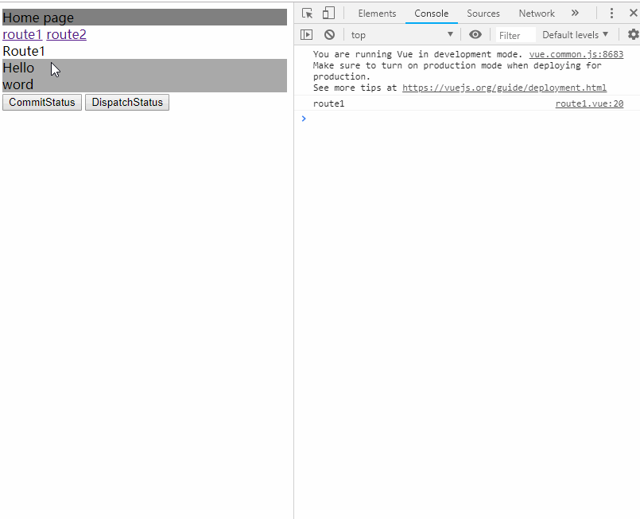
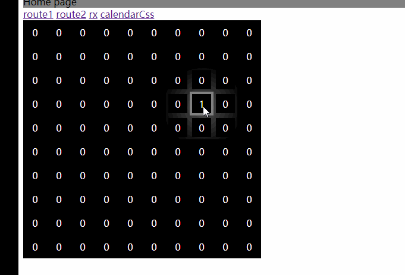

### MAYBE this is the simplest front-end project you've ever met, because of the headache configurations of webpack projects.[简体中文](/README_ZH.md)

1. Initial

   * You should install [yarn](https://yarnpkg.com/en/) (fast, reliable, and secure dependency management) and [parcel](https://parceljs.org/)(blazing fast, zero configuration web application bundler) at first.

     1. `npm install -g yarn`
     2. `yarn global add parcel`

   * project init

     1. `yarn init`

     2. create directory

        - `index.html` the entrance of your web site. Use command `parcel index.html` will run it.
        - `tsconfig.json` typescript configuration
        - `tslint.json` tslint file.
        - `.babelrc` the rules of babel. You can set an alias of `src` in this configuration.
        - `src/components` vue components.
        - `src/config` I config my `router` and `store` and maybe other global stuffs here. 
        - `src/App.vue` vue entrance
        - `src/main.ts` ts entrance that will be mount to `index.html`

     3. notice

        - you can set an alias in `.babelrc`

        - pre-compiler. Vue suggest us set an alias of vue in `package.json` to help compile `.vue`

          ```json
          {
              "alias": {
              	"vue": "./node_modules/vue/dist/vue.common.js"
          	}
          }
          ```

        - There is an [warning](https://github.com/vuejs/vue-cli/issues/1198) on vscode. We can avoid it by add this:

          ```js
          // @ts-ignore
          import app from '@App.vue'
          ```

        - To avoid `implicit type of any` by set `noImplicitAny` = `false` in `tsconfig.json`

          ```json
          {
            "compilerOptions": {
              // ······
              "noImplicitAny": false
            }
          }
          ```

2. module

   * `babel`. We need babel different type of files.

   * `parcel-bundler`. We need it too. `parcel3.0` help us deal some stuffs with vue, it's awesome convenient.

   * Maybe this is the least configuration？

     ```json
     {
       "dependencies": {
         "@babel/preset-env": "^7.2.3",
         "autoprefixer": "^9.4.3",
         "src": "^1.1.2",
         "vue": "^2.5.21",
         "vue-hot-reload-api": "^2.3.1",
         "vue-router": "^3.0.2",
         "vuex": "^3.0.1"
       },
       "devDependencies": {
         "@babel/core": "^7.2.2",
         "@types/node": "^10.12.18",
         "@vue/component-compiler-utils": "^2.3.1",
         "babel-plugin-module-resolver": "^3.1.1",
         "parcel-bundler": "^1.11.0",
         "less": "^3.9.0",
         "tslint": "^5.12.0",
         "typescript": "^3.2.2",
         "vue-template-compiler": "^2.5.21"
       },
       "scripts": {
         "start": "parcel index.html"
       },
       "alias": {
         "vue": "./node_modules/vue/dist/vue.common.js"
       }
     }
     ```

   * I cannot stop praising `parcel` that do many for us and we can set less configurations.Awesome!

3. coding

   * add router。Just write like a `webpack+es6` project

     ```typescript
     import Vue from 'vue';
     import Router from 'vue-router';
     
     Vue.use(Router);
     
     export default new Router({
       routes: [
         {
           path: '/route1',
           // @ts-ignore
           component: () => import('@/components/route1.vue')
         },
         {
           path: '/route2',
           // @ts-ignore
           component: () => import('@/components/route2.vue')
         }
       ]
     });
     ```

   * add state management. Just write like a `webpack+es6` project

     ```typescript
     // store/index.ts
     import Vue from 'vue';
     import Vuex from 'vuex';
     
     import module1 from './modules/module1';
     import module2 from './modules/module2';
     
     Vue.use(Vuex);
     
     export default new Vuex.Store({
       modules: {
         module1,
         module2
       },
       strict: true
     });
     
     // store/modules/module1.ts
     export default {
       namespaced: true,
       state: {
         status: 0
       },
       getters: {
         getStatus: (state: any) => state.status
       },
       mutations: {
         updateStatus(state: any, status: number) {
           console.log('module1 status updated', status);
           state.status = status;
         }
       },
       actions: {
         updateStatus({commit, state}, status: number) {
           console.log('module1 dispathed', state.status, status);
           commit('updateStatus', status);
         }
       }
     };
     
     ```

   * components. No big difference compared with `webpack+es+vue`project

     ```vue
     <template>
       <div>
         <header>Route1</header>
         <section>
           <div>Hello</div>
           <div>word</div>
         </section>
         <footer>
           <button @click="commitStatus">CommitStatus</button>
           <button @click="dispatchStatus">DispatchStatus</button>
         </footer>
       </div>
     </template>
     <script lang="ts">
     import Vue from 'vue';
     import {mapGetters} from 'vuex';
     export default Vue.extend({
       name: 'route1',
       created() {
         console.log('route1');
       },
       computed: {
         ...mapGetters({
           status: 'module1/getStatus'
         })
       },
       watch: {
         status(newValue: number, oldValue: number) {
           console.log('route1', newValue, oldValue);
         }
       },
       methods: {
         commitStatus() {
           this.$store.commit('module1/updateStatus', this.status + 1);
         },
         dispatchStatus() {
           this.$store.dispatch('module1/updateStatus', this.status + 1);
         }
       }
     });
     </script>
     
     
     ```

4. Running

   * `parcel index.html` or`yarn start` . It's super NICE that `parcel` will get the dependencies from network when we execute `parcel something.html`
   * Any other awesome discoveries？Almost all `parcel` plugins start with `parcel-plugin-`. If you need an `application cache`? just add a dependency `parcel-plugin-appcache`; need a` webworker`？No difference between `parcel-ts-vue` and `webpack-es-vue`

5. Example GIF

    Vue-Router Vuex
   
    Calendar-Hover-Css
   

6. Why `parcel-ts-vue`?

   * new techniques that will make coding easier.
   * they have awesome features to be discovered.Let's go!
   * last but least, it's more easier to create an complete project.

7. TODO

   * maybe add `test` framework.
   * maybe more advanced techniques will be integrated