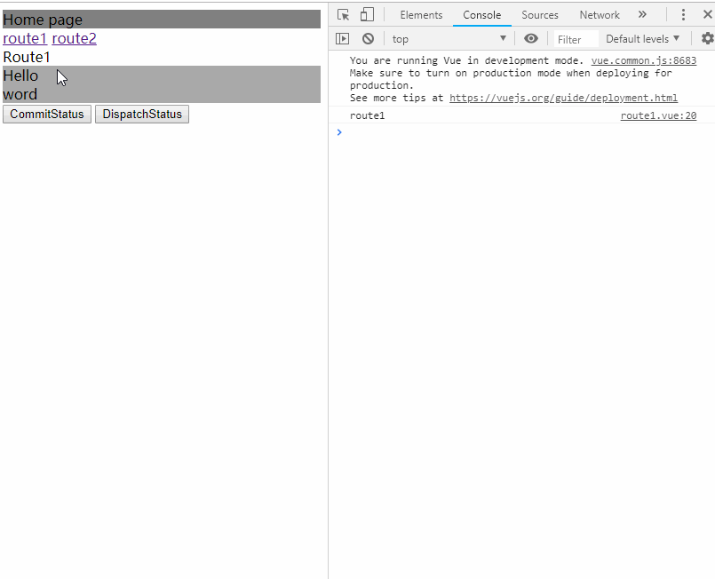

这可能是您见过的最简单的前端项目，毕竟那些充满配置的webpack打包的工程，看了就头疼。集合了vue、yarn、parcel、typescript。__拥抱变化吧，朋友__。[English](/README.md)

1. 初始化

   * 没安装[yarn](https://yarnpkg.com/en/) (fast, reliable, and secure dependency management)和 [parcel](https://parceljs.org/)(blazing fast, zero configuration web application bundler)的。先全局安装这两个

     1. `npm install -g yarn`
     2. `yarn global add parcel`

   * 初始化

     1. `yarn init`

     2. 创建目录

        - `index.html` 页面入口。启动很简单，使用`parcel index.html`就可以开启
        - `tsconfig.json` 配置ts。重点是配置module=es2015，type=node，lib=[几个]
        - `tslint.json` ts文件校验规则。按个人习惯配置。
        - `.babelrc` babel文件。内含别名创建，parcel会自动读取这里的别名来做模块化。
        - `src/components` vue组件
        - `src/config` 项目配置。含 router和store。
        - `src/App.vue` vue主页面
        - `src/main.ts` vue入口 需要挂载到`index.html`

     3. 配置注意事项

        - babel内创建路径别名（如@=src），然后可以像通常的webpack脚手架一样用

        - 模板文件预编译。官方推荐使用parcel的用户在`package.json`中配置下面的内容。不然会报错，让你预编译你的.vue文件。

          ```json
          {
              "alias": {
              	"vue": "./node_modules/vue/dist/vue.common.js"
          	}
          }
          ```

        - ts校验规则里面对`.vue`文件的引入还有问题(vscode会报模块找不到，但是parcel能能够正常编译运行)，尤大也去提了问。。所以涉及到`.vue`引入的内容，可以用`// @ts-ignore`来规避。即：

          ```js
          // @ts-ignore
          import app from '@App.vue'
          ```

        - `.ts`文件内经常会用到一些vue提供的方法，往往不想指定入参类型。在`tsconfig.json`内用`noImplicitAny`禁掉校验报错的问题。

          ```json
          {
            "compilerOptions": {
              // ······
              "noImplicitAny": false
            }
          }
          ```

2. 模块化

   * `babel`是必须的

   * `parcel-bundler`也是必须的。`parcel3.0`提供了默认的vue解析，非常便利。

   * 大概这些是最小配置？其余内容可以自行配置。

     ```json
     {
       "dependencies": {
         "@babel/preset-env": "^7.2.3",
         "autoprefixer": "^9.4.3",
         "src": "^1.1.2",
         "vue": "^2.5.21",
         "vue-hot-reload-api": "^2.3.1",
         "vue-router": "^3.0.2",
         "vuex": "^3.0.1"
       },
       "devDependencies": {
         "@babel/core": "^7.2.2",
         "@types/node": "^10.12.18",
         "@vue/component-compiler-utils": "^2.3.1",
         "babel-plugin-module-resolver": "^3.1.1",
         "parcel-bundler": "^1.11.0",
         "less": "^3.9.0",
         "tslint": "^5.12.0",
         "typescript": "^3.2.2",
         "vue-template-compiler": "^2.5.21"
       },
       "scripts": {
         "start": "parcel index.html"
       },
       "alias": {
         "vue": "./node_modules/vue/dist/vue.common.js"
       }
     }
     ```

   * 其实依赖的内容，`parcel`在运行的时候会自动添加，非常方便`+666`。

3. 代码

   * 引入路由。参考webpack+es6下的vue配置，可以写出：

     ```typescript
     import Vue from 'vue';
     import Router from 'vue-router';
     
     Vue.use(Router);
     
     export default new Router({
       routes: [
         {
           path: '/route1',
           // @ts-ignore
           component: () => import('@/components/route1.vue')
         },
         {
           path: '/route2',
           // @ts-ignore
           component: () => import('@/components/route2.vue')
         }
       ]
     });
     ```

   * 引入状态。同样，参考你常规的webpack+es6下的vue配置就行了。

     ```typescript
     // store/index.ts
     import Vue from 'vue';
     import Vuex from 'vuex';
     
     import module1 from './modules/module1';
     import module2 from './modules/module2';
     
     Vue.use(Vuex);
     
     export default new Vuex.Store({
       modules: {
         module1,
         module2
       },
       strict: true
     });
     
     // store/modules/module1.ts
     export default {
       namespaced: true,
       state: {
         status: 0
       },
       getters: {
         getStatus: (state: any) => state.status
       },
       mutations: {
         updateStatus(state: any, status: number) {
           console.log('module1 status updated', status);
           state.status = status;
         }
       },
       actions: {
         updateStatus({commit, state}, status: number) {
           console.log('module1 dispathed', state.status, status);
           commit('updateStatus', status);
         }
       }
     };
     
     ```

   * 组件。vscode装了插件后，有快速代码模块(一大块不用手写)。大概是这个样子。

     ```vue
     <template>
       <div>
         <header>Route1</header>
         <section>
           <div>Hello</div>
           <div>word</div>
         </section>
         <footer>
           <button @click="commitStatus">CommitStatus</button>
           <button @click="dispatchStatus">DispatchStatus</button>
         </footer>
       </div>
     </template>
     <script lang="ts">
     import Vue from 'vue';
     import {mapGetters} from 'vuex';
     export default Vue.extend({
       name: 'route1',
       created() {
         console.log('route1');
       },
       computed: {
         ...mapGetters({
           status: 'module1/getStatus'
         })
       },
       watch: {
         status(newValue: number, oldValue: number) {
           console.log('route1', newValue, oldValue);
         }
       },
       methods: {
         commitStatus() {
           this.$store.commit('module1/updateStatus', this.status + 1);
         },
         dispatchStatus() {
           this.$store.dispatch('module1/updateStatus', this.status + 1);
         }
       }
     });
     </script>
     
     
     ```

4. 运行。

   * `parcel index.html` 或`yarn start` parcel会自动去拉去你需要的依赖包。非常NICE
   * 做点其他的？parcel插件都以`parcel-plugin-`开头，要加个离线缓存？(`parcel-plugin-appcache`)要加个worker？加就行了，写法和es6几乎没有差别

5. 示例运行

   路由 状态管理
   
    win10 日历hover效果
   

6. 为什么是`parcel-ts-vue`?

   * 新技术往往能够带给我们兴奋感，作为新技术出现的他们，可能让我们写代码更加轻松。（PS：vue 3.0将引入更多特性）
   * 这些技术有很多等待发现的兴奋点。
   * 最重要的，用这些能让我更轻松地构建一个完整而健壮的项目，更方便的一定是属于未来的。

7. TODO

   * 可能加个测试框架进来
   * 可能增加更多的前沿技术，集成到这里。让这个工程成为新技术测试点。